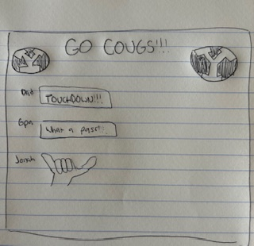

# Virtual ROC

[My Notes](notes.md)

A brief description of the application here. Hi! This is my first time using github. Does this work?
Yes!! This works. I have now made another change, but I'm going to try and do this from the terminal. Yay! I am now a pro at editing things in VS code and Github.

## 🚀 Specification Deliverable

For this deliverable I did the following. I checked the box `[x]` and added a description for things I completed.

- [x] Proper use of Markdown
- [x] A concise and compelling elevator pitch
- [x] Description of key features
- [x] Description of how you will use each technology
- [x] One or more rough sketches of your application. Images must be embedded in this file using Markdown image references.

### Elevator pitch

I come from a family of die-hard BYU fans. We love watching the BYU football, soccer, volleyball, and basketball games, but we can never watch the games together because we're all scattered across the country! Go Cougs allows a group of friends or family to react to the game in real time in a BYU themed group chat where you can share the joys of victory with those you love!

### Design

The interface should display plenty of BYU school spirit, with some custom emoji's and/or GIF's that are BYU specific.

### Key features

- Login with username and password
- Clean aesthetics, themed in Royal blue and White
- Custom reactions such as Touchdown, Field Goal, First down, DEFENSE, 3rd down roar, Cosmo dance, Y hand, Sitake dance, etc.
- Display of motivational quotes
- Real time chat updates

### Technologies

I am going to use the required technologies in the following ways.

- **HTML** - Uses correct HTML structure. Probably 2 HTML pages, 1 for login, and 1 for chatting
- **CSS** - Application adjustable for all screen sizes. BYU theme makes you want to rise and shout.
- **React** - Provides login, displays chat messages, allows user input for chat and/or reactions
- **Service** - Backend services for login and logout, will use the Inspiration API to give random motivational quotes
- **DB/Login** - Register and login users. Remember chat history
- **WebSocket** - Chat messages and reactions updated real time on all connected users

## 🚀 AWS deliverable

For this deliverable I did the following. I checked the box `[x]` and added a description for things I completed.

- [X] **Server deployed and accessible with custom domain name** - [My server link](https://virtualroc.link).

## 🚀 HTML deliverable

For this deliverable I did the following. I checked the box `[x]` and added a description for things I completed.

- [X] **HTML pages** - There are 3 html pages. Index.html(main login), about_roc.html(about_page), chat.html(chat window)
- [X] **Proper HTML element usage** - proper use of html, body, header, nav, main, footer
- [X] **Links** - Links in the nav section go to their respective pages
- [X] **Text** - Lots of text for login info, about page has lots of text, chat has text fillers
- [X] **3rd party API placeholder** - At bottom of about_roc page there is a placeholder to display motivational quotes in case of a BYU loss
- [X] **Images** - Cosmo sailor hat image on each webpage
- [X] **Login placeholder** - login placeholder on main page (index.html)
- [X] **DB data placeholder** - Will store how many total messages a user has sent in the chat. Also will store in memory the last 10 chats
- [X] **WebSocket placeholder** - Chat section will allow chats to be sent and updated in real time.

## 🚀 CSS deliverable

For this deliverable I did the following. I checked the box `[x]` and added a description for things I completed.

- [x] **Header, footer, and main content body** - Header and footer is consistently and beautifully styled on all 3 pages
- [x] **Navigation elements** - Links to home, about, and chat in header
- [x] **Responsive to window resizing** - Media queries on all css files adapting the header and main content to fit a smaller screen size
- [x] **Application elements** - I used some cards from bootstrap for the about page. The rest of formatting is with various divs and flex view to make box structures
- [x] **Application text content** - Text is nicely styled and text size adapt to screen size
- [x] **Application images** - Cosmo hat logo on header, two pictures in the about page

## 🚀 React part 1: Routing deliverable

For this deliverable I did the following. I checked the box `[x]` and added a description for things I completed.

- [ ] **Bundled using Vite** - I did not complete this part of the deliverable.
- [ ] **Components** - I did not complete this part of the deliverable.
- [ ] **Router** - I did not complete this part of the deliverable.

## 🚀 React part 2: Reactivity deliverable

For this deliverable I did the following. I checked the box `[x]` and added a description for things I completed.

- [ ] **All functionality implemented or mocked out** - I did not complete this part of the deliverable.
- [ ] **Hooks** - I did not complete this part of the deliverable.

## 🚀 Service deliverable

For this deliverable I did the following. I checked the box `[x]` and added a description for things I completed.

- [ ] **Node.js/Express HTTP service** - I did not complete this part of the deliverable.
- [ ] **Static middleware for frontend** - I did not complete this part of the deliverable.
- [ ] **Calls to third party endpoints** - I did not complete this part of the deliverable.
- [ ] **Backend service endpoints** - I did not complete this part of the deliverable.
- [ ] **Frontend calls service endpoints** - I did not complete this part of the deliverable.
- [ ] **Supports registration, login, logout, and restricted endpoint** - I did not complete this part of the deliverable.

## 🚀 DB deliverable

For this deliverable I did the following. I checked the box `[x]` and added a description for things I completed.

- [ ] **Stores data in MongoDB** - I did not complete this part of the deliverable.
- [ ] **Stores credentials in MongoDB** - I did not complete this part of the deliverable.

## 🚀 WebSocket deliverable

For this deliverable I did the following. I checked the box `[x]` and added a description for things I completed.

- [ ] **Backend listens for WebSocket connection** - I did not complete this part of the deliverable.
- [ ] **Frontend makes WebSocket connection** - I did not complete this part of the deliverable.
- [ ] **Data sent over WebSocket connection** - I did not complete this part of the deliverable.
- [ ] **WebSocket data displayed** - I did not complete this part of the deliverable.
- [ ] **Application is fully functional** - I did not complete this part of the deliverable.
