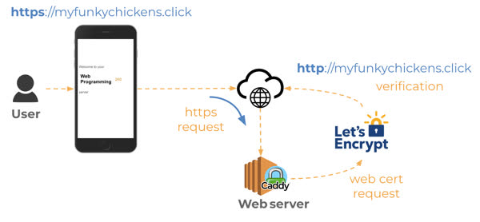

# CS 260 Notes

[My startup - Simon](https://simon.cs260.click)

## Tips About Using Github and VSCode

If you change the README or notes files in Github, use the little pencil icon, make your edits, and commit changes with a title.

In **the terminal**, run `git fetch`, `git status`, git should say that there is a change that has not been updated. Then use `git pull` to pull those changes from github onto your VS code

To send changes from VSCode back to github, first in the terminal run `git add .` this adds all the changes that you just made, aka staging the commit. Then commit those changes using `git commit -m "insert title"` Once you've committed, push those changes to github using `git push`

## Helpful links

- [Course instruction](https://github.com/webprogramming260)
- [Canvas](https://byu.instructure.com)
- [MDN](https://developer.mozilla.org)

## AWS

45% of the industry uses AWS as a cloud computing service, providing secure and reliable services from development, to storage, to upscaling or downscaling a website. **EC2** is a service that allows you to essentially rent space on a server to host your website. This allows you to host and manage a website without having to use your own hardware, and it is a safe and cheap option. I created my first EC2 **instance**. I didn't understand a lot of the specific settings that they asked us to use, but I copied the CS260 template to be the beginnings of my website. I used a **t3.nano** server size because it is the cheapest option and my website shouldn't have a large amount of traffic on it while I am developing it. Plus, my website won't need a ton of processing power so it will do just fine with a t3.nano instead of a t3.micro or t2.micro server size.

This is super secure, and I had to create a **key pair**, which is a file of code that serves as an encrypted password to access my instance. I also had to set up a two-factor authentication with Duo Mobile in order to log in to my account. I noticed that you can have a ICS account for your website. I as the owner login as the root, but it makes sense that I could give access to employees or others to work on and manage my AWS instances, but they would not have ownership. I thought that was interesting.

The default for EC2 is that you are given an IP address (internet ID) for your website. But if I shut the website down and then rebooted it, EC2 would give me a different IP address, which would be annoying because then I'd have to reassign it to my domain name, change lots of stuff, etc. To fix this issue, I created an **elastic IP address**. This means that I essentially own an IP address, and I can assign any of my instances to that IP address. This is nice because even if I reset the website I can keep the same IP address every time.

I used **Route 43**, another AWS service, to select a domain name for my website. I bought the name <http://virtualroc.link> for $5. The .link was cheaper than a .com or .org, but maybe if this website gets pretty functional I might but the .com domain name and try to upscale a bit. 

My IP address is: 34.206.104.67


## Caddy


**Caddy** is a webservice that manages encryption of data when any computer is in communciation with our website. It uses **Let's Encrypt** to create a free TLS (Transport Layer Security) certificate. This is basically how secure connections are made on the internat. 

Using *http*, data flows from computer to computer without being encrypted, which makes it really easy to steal information. Let's Encrypt creates a TLS certificate, which contains a public and private key. The server and client each exchange their public keys, and then a encryption algorithm is performed to create a private key that is only known by those 2 devices. The certificate certifies that both parties are legit. Once this "handshake" has taken place, the client and server are free to communcate securely. That's why in most browsers, the *https* domains have a little lock by them that say secure.




I had to manually enter into the web server using my key pair and ubuntu. I edited the Caddy file to route through my domain name instead of :80, which represented http. Caddy automatically registered my domain for a TLS certificate via Let's Encrypt and now my website is SECURE!

<https://virtualroc.link>
^Did you notice the s? :)


## HTML Notes

HTML is essentially the base level for organizing text on a webpage. It is a markdown language, and formats text using **tags**. Here is an example of the first bit of HTML I wrote using [codepen.io](https://codepen.io)

```
<body>
  <main>
    <h3>Welcome to my website</h3>
    <p class="intro"> This website consists of...</p>
    <ul>
      <li>text</li>
      <li>bullet points</li>
      <li>cool stuff</li>
    </ul>
    <p class="outro"> I hope you enjoy our content! Learn more <a href="https://virtualroc.link">here</a>!</p>
  </main>
</body>
```

I learned how to examine the html for simon by cloning the code from the cs260 git repository. I can view it in a live server by using that extension in VS code, then I can use the inspect feature to go through the html elements and they are highlighted on the webpage so I can see what the code turns into. Pretty useful. I looked at a lot of elements, and noticed the importance of structural pieces sus as `<div>`, `<header>`, `<body>`, etc.  I also learned that you can use `<input type='text'>` to include a text box input, which will be super useful for when I want to input chat messages into virtual roc.

Most html elements have a `name` attribute and an `id` attribute. I was curious about this. **ID** is used for CSS to identify and highlight specific html elements and select them for styling. **Name** attributes are used for items where information must be sent to the backend. In input items, when the form is submitted, the name is the first part of a key value pair sent out. For example, a text box with name "fullname" and text "Jonah Shirts" would be sent like this fullname=Jonah Shirts

## Virtual ROC HTML notes

Some quick things I learned from designing my html

- You want to wrap nearly everything in a `div` or `section` or `nav` grouping. If you don't put it in a grouping, it severely limits the styling you can do with CSS
- **DON'T FORGET TO COMMIT REGULARLY** I accidentally made the entire index and about pages without committing. I'm not quite sure what I did (it was a branch that I had to merge to the main) I'm learning a bit about how forking and merging works still. But I clearly understand committing and pushing to the repository.
- `id`, `class`, and `name` attributes are VERY useful to categorize sections of the webpage. You can identify them later on to do specific actions.


## CSS

The best way to include CSS styling in your html file is to include it with a link. It MUST be in the *header*. Here's an example:

```<link rel="stylesheet" href="styles.css" />```

styles.css

```
p {
  color: green;
}
```


You can format the display in different ways to allow your website to be comfortably viewed on any size screen. Here is an example of block, inline, flex, and grid displays.


In order to adapt your website to a mobile browser, you should first use this code in the `head` tag to disable the browser's default scaling.

`<meta name="viewport" content="width=device-width,initial-scale=1" />`


You can also import `media` which will allow you to detect which orientation the device is in. 

```@media (orientation: portrait) {
  div {
    transform: rotate(270deg);
  }
}
```
In this code, when the orientation changes to portrait mode, it will rotate all of the div elements 270 degrees.

```
@media (orientation: portrait) {
  aside {
    display: none;
  }
}
```
While this code will hide an aside element when the phone is in portrait mode because it'll be too crowded with the narrow screen.


Additional Notes:

Padding!!!

`padding: 10px, 20px` = top+bottom 10px,  left+right 20px 

`padding: 10px, 20px, 15px` = top, left+right, bottom 

`padding: 10px, 15px, 20px, 20px` = top, right, bottom, left


## Javascript

**Javascript is by far the most used programming language in the world.**

We can run javascript in the terminal using Node.js. It runs it in the same way Google Chrome does, but in the terminal instead of a browser. I installed Node and learned how to use it and install packages. Packages are open-source prewritten javascript that can be brought in to my code and utilized. Kind of like Python libraries or Bootstrap elements.

**Node Checklist**

1. Create your project directory
2. Initialize it for use with NPM by running npm init -y
3. Make sure .gitignore file contains node_modules
4. Install any desired packages with npm install <package name here>
5. Add require('<package name here>') to your application's JavaScript
6. Use the code the package provides in your JavaScript
7. Run your code with node index.js

Javascript uses different types of function notation. First is regular. Here's an example:

```function Hi(name){
      console.log("Hi " + name)
  }
```

The other way is shorthanded version using **arrow functions**. This was a bit tricky, but it seems to be a lot like lambda functions in python. Here's an example from codepen. The code has a function testAll that takes in a function as a parameter, we use the arrow function when we call testAll so we don't have to define another function.

```
function testAll(input, tester) {
  const result = input.some(tester)
  return result
}

const result = testAll([1,2,3,4,5], (i) => i < 6);

console.log(result);
```

Some useful functions for modifying arrays:
|Function	|  Meaning	                                                 |   Example|
|---------|------------------------------------------------------------|-------------------------|
|push	    |  Add an item to the end of the array	                     |   `a.push(4)`|
|pop	    |    Remove an item from the end of the array	               |   `x = a.pop()`|
|slice	  |    Return a sub-array	                                     |   `a.slice(1,-1)`|
|sort	    |  Run a function to sort an array in place	                 | `a.sort((a,b) => b-a)`|
|values	  |  Creates an iterator for use with a for of loop	           | `for (i of a.values()) {...}`|
|find	    |  Find the first item satisfied by a test function	         | `a.find(i => i < 2)`|
|forEach	|    Run a function on each array item	                     |     `a.forEach(console.log)`|
|reduce	  |  Run a function to reduce each array item to a single item |  `a.reduce((a, c) => a + c)`|
|map	    |    Run a function to map an array to a new array	         |     `a.map(i => i+i)`|
|filter	  |  Run a function to remove items	                           | `a.filter(i => i%2)`|
|every	  |    Run a function to test if all items match	             |     `a.every(i => i < 3)`|
|some	    |  Run a function to test if any items match	               |   `a.some(i => i < 1)`|


There are also classes and object-oriented programming: Refer to this code block to see a bit of the functionality. The `#` means that it is a private attribute.
```
class Person {
  constructor(name) {
    this.name = name;
  }

  print() {
    return 'My name is ' + this.name;
  }
}

class Employee extends Person {
  constructor(name, position) {
    super(name);
    this.position = position;
  }

  print() {
    return super.print() + '. I am a ' + this.position;
  }
}

const e = new Employee('Eich', 'programmer');
console.log(e.print());
// OUTPUT: My name is Eich. I am a programmer
```


**ACTUALLY REALLY IMPORTANT JAVASCRIPT FUNCTIONS**

1) Javascript elements to select an html element (NOT USED IN REACT!) Imperatively change the DOM:
   - `document.getElementById(id)` will select a certain html element with id
   - `document.querySelect(selector)` returns the first element that matches a certain CSS selector (element)

2) React uses instead these functions that work declaratively (returning html instead of manipulating existing html)
   - `useState` creates a variable and a setVariable function that sets the initial value and the function can be used to change that value
   - `useEffect` used on things that can cause side effects (non html rendering). The first parameter is the code you want to run, the second parameter, the dependency array uses the []. [] alone means only do this once. This prevents the code from running every time the component updates or rerenders.


## Midterm Prep

**Event listeners**
ex. element.addEventListener(eventType, callbackFunction);

| Event Type | Triggered When…                     |
|------------|-------------------------------------|
| `click`    | User clicks the element             |
| `input`    | User types into an input field      |
| `mouseover`| Mouse hovers over the element       |
| `submit`   | Form is submitted                   |
| `keydown`  | Key is pressed                      |


**Console commands**
| Command   | Purpose                                           |
|-----------|---------------------------------------------------|
| `chmod`   | Change file permissions (e.g., read/write/execute)|
| `pwd`     | Print current working directory                   |
| `cd`      | Change directory                                  |
| `ls`      | List files and directories                        |
| `ls-la`   | Do ls but with more details                       |
| `vim`     | Open the Vim text editor (powerful, keyboard-driven) |
| `nano`    | Open the Nano text editor (simpler, beginner-friendly) |
| `mkdir`   | Make a new directory                              |
| `mv`      | Move or rename files/directories                  |
| `rm`      | Remove (delete) files or directories              |
| `man`     | Show manual/help page for a command               |
| `ssh`     | Securely connect to another machine (remote login)|
| `ps`      | Show running processes                            |
| `wget`    | Download files from the web                       |
| `sudo`    | Run a command with superuser (admin) privileges   |


**Domain System**

Example: banana.fruit.bozo.click

| Part         | Role                     |
|--------------|--------------------------|
| `click`      | **Top-Level Domain (TLD)** — like `.com`, `.org`, `.click` |
| `bozo`       | **Root Domain** — the domain you register (`bozo.click`) |
| `fruit`      | **Subdomain** — subdivision of `bozo.click` |
| `banana`     | **Sub-subdomain** — further subdivision of `fruit.bozo.click` |


## Http Ports

| Port | Protocol                                                                 |
|------|--------------------------------------------------------------------------|
| 20   | File Transfer Protocol (FTP) for data transfer                           |
| 22   | Secure Shell (SSH) for connecting to remote devices                      |
| 25   | Simple Mail Transfer Protocol (SMTP) for sending email                   |
| 53   | Domain Name System (DNS) for looking up IP addresses                     |
| 80   | Hypertext Transfer Protocol (HTTP) for web requests                      |
| 110  | Post Office Protocol (POP3) for retrieving email                         |
| 123  | Network Time Protocol (NTP) for managing time                            |
| 161  | Simple Network Management Protocol (SNMP) for managing network devices   |
| 194  | Internet Relay Chat (IRC) for chatting                                   |
| 443  | HTTP Secure (HTTPS) for secure web requests                              |


## React Part 1: Routing

We are transferring our project from pure html and css to React. We use the `Browser Router` component along with the `Routes` and `Route` tags to make the webpage routed through React instead of the browser using <a> tags. That is why none of the url's you see in websites ends with .html, because they're using React routing or another similar service.

We do this by using **Vite**, which is a software that packages .jsx files that React reads into usable Javascript and CSS that a browser can use. Running the dev command in Vite also allows us to view a http page of the react website (replacement of Live Server when using html in VS Code).


First, you must organize your files in a specific way. The **index.html** file is basically just a default file that has some head information, imports the javascript, and sets up a root div that is linked to the **App.jsx file**. In the index.jsx file we create that root and link it to the App component. The app component is the default component for React. It is the parent component that covers all other components of your website. 

We put our `app.jsx` and `app.css` in the **src** directory. Inside each directory, create a folder for each component with it's own corresponding .jsx and .css files. All images used in the website are placed in the **public** directory.


In the `app.jsx` file, I imported my header and footer html, but instead of main I created a React Routing system by wrapping the entire page in the  `<BrowserRouter>` tag. Then in the place of the <main> tag, I placed the following:

```
<Routes>
  <Route path='/' element={<Login />} exact />
  <Route path='/chat' element={<Chat />} />
  <Route path='/about' element={<About />} />
  <Route path='*' element={<NotFound />} />  
</Routes>
```

These basically mean that when the page is at that certain link (/, /chat, /about, or any other link), The element displayed in this location will be the output of the function written in each component's jsx file. We had to fix our <a> tags to be `<NavLink>` tabs, which work with the router. Change the `href` element to `to` element, which directs the link to a certain React path that is linked up to the Router. Here's an example: `<NavLink className="nav_links" to="chat">Chat</NavLink>`

Also, we had to make some minor changes when tranfering over, first all `class` elements had to be changed to `className `, the `<body>` tag had to be changed to a `<div className = 'body'>` and the corresponding CSS had to use `.body {` as a selector instead of `body {`.  Also `` tags had to end with a `/>` instead of just a backslash.


## React Part 2: Reactivity

This was a lot of fun to see it all come together. I had to keep remembering to use React state instead of just manipulating the DOM directly.

Handling the toggling of the checkboxes was particularly interesting.

```jsx
<div className="input-group sound-button-container">
  {calmSoundTypes.map((sound, index) => (
    <div key={index} className="form-check form-switch">
      <input
        className="form-check-input"
        type="checkbox"
        value={sound}
        id={sound}
        onChange={() => togglePlay(sound)}
        checked={selectedSounds.includes(sound)}
      ></input>
      <label className="form-check-label" htmlFor={sound}>
        {sound}
      </label>
    </div>
  ))}
</div>
```
